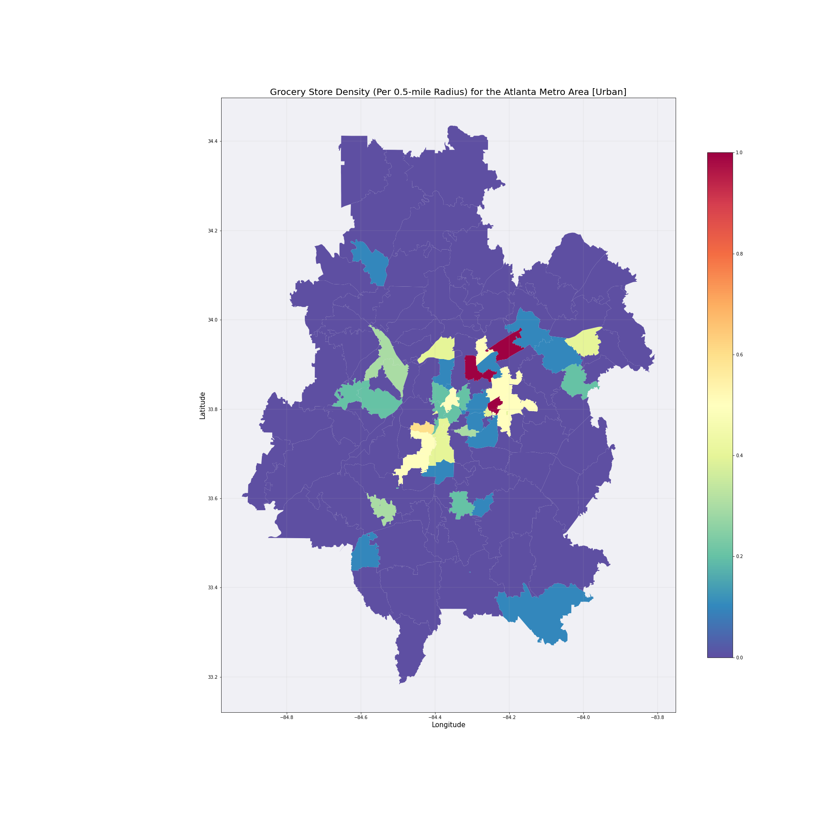

# Introduction
A food desert is defined as an area where the distance to a supermarket is greater than one quarter of a mile and the median household income is at or below 185% of the national poverty line. These households largely rely on public transportation and the supermarkets in the area yield low scores in the Healthy Food Availability Index. From our research, we found that few studies used machine learning techniques to identify variables that contributed to food deserts and for the limited number of studies that did, housing market data was not incorporated. Thus, we used housing data from Redfin and SNAP food data to research different factors related to food access using census data. 

The goal of this project was to analyze the correlation between the existence of food deserts and various factors such as income, race, median list and sold price, average grocery store counts, and number of food deserts. This article we will provide exploratory data analysis for the four datasets used, pre-modeling techniques, and our linear regression machine learning models for various years to classify the factors that influence the existence of food deserts. 

The code for this project can be found in our Github repository.
## Contents
### Notebooks
- [SNAP]()
- [Redfin]()
- [Census]()
### Data
- [SNAP](SNAP_Data.csv)
- [Redfin]()
- [Census]()
- [Grocery Density Tables](Groche Desnity)
- [zip Location per Metro](Metro_Zips)
- [zip Polygon data (for mapping)](Shape_Files)
## Motivation & Background
Food access is a key component of food security security and equity and each individual having access to nutrient-dense, affordable food is a basic human right. Low food equity has been associated with various health issues and socioeconomic factors. 

The purpose of food desert research is to understand factors that contribute to food deserts in American cities and use findings to inform stakeholders in the public health, economy, nutrition, and urban planning sectors. 

A recent article in the Washington Post highlights the heightened purchase of homes by investment groups.  Further readings indicate that neighborhoods with higher investor purchases are part of historically underserved communities.
We are interested in examining the cross-section of these events, and hope to generate some insightful models.  

## Dataset

There were five datasets aggregated to compile the final dataset used from real estate housing data from Redfin, U.S. census data from Kaggle, SNAP food data from the SNAP retailers database, and food access data from the USDA Food Access Research Atlas. These datasets contain demographic, food access, housing, SNAP, and zip code data. 

The compiled dataset is made up of columns listed in the data attributes section. The dataset used for the linear regression model is made up of the following columns: zip code, period begin, property type, median sale price, median list price, homes sold, new listings, median domestic price, sold above listing price, county, total population, % men, % women, Black, White, Native, Asian, Pacific, citizen, child poverty, service, office, drive, carpool, transit, walk, other transportation, work at home, mean commute, employed, private work, public work, self employed, family work, average nearby grocery stores, number of food deserts, and desert.

### Insight of Data
- zip: zip code 
- period begin: when store began accepting SNAP
- property type: condo/single family…etc
- median sale price: median value homes in this group sold for
- median list price: median value homes in this group were listed for
- homes sold: number of homes sold in area
- new listings:  number of new listings in this group
- median domestic price: median domestic price 
- sold above listing price: price sold above liste=ing 
- county: county
- total pop: total population 
- Men: number of men
- Women: number of women
- Black: % of population that is Black
- White:  % of population that is White
- Native: % of population that is Native American or Native Alaskan
- Asian: % of population that is Asian
- Pacific: % of population that is Native Hawaiian or Pacific Islander
- Hispanic: % of population that is Hispanic/Latino
- Citizen: Number of Citizens
- child poverty: % of children under poverty level
- service: % employed in service jobs
- office:  % employed in sales and office jobs
- drive: % commuting alone in a car, van, or truck
- carpool: % carpooling in a car, van, or truck
- transit: % commuting on public transportation
- walk:  % walking to work
- other transportation:  % commuting via other means
- work at home:  % working at home
- mean commute:  Mean commute time (minutes)
- employed: Number of employed (16+)
- private work: % employed in private industry
- public work:  % employed in public jobs
- self employed:  % self-employed
- family work: % in unpaid family work 
- average nearby grocery stores: count of nearby stores 
- number of food deserts: number of food deserts 
-desert: Well Fed = non- food desert, Desert = food desert

## Approach and Research Questions

Conduct EDA and find correlations between factors that contribute to food access and create visualizations. 
Use a linear regression model for classification of dataset.

## Research Questions 

Which variables are factors related to food deserts? 
What are the correlations between different variables and food deserts?
Is the housing market a good predictor of food access in U.S. counties?

## Literature Review
- Several studies catalog the existence of food deserts around the country. However, the current research does little to thoroughly delineate the presence or absence of food deserts in the U.S. or explain why food deserts exist.
- In the UC Berkeley Food Desert Study (2017), their graduate team built a predictive model that used USDA Food Access Research Atlas tool to predict food insecurity before it occurred. Their model was 80% accurate. 
- Almalki et. al (2021) This study used regression analysis to show the geographic correlation between high blood pressure, high cholesterol, and obesity. 

## Dataset Info
### SNAP
- This data contains a list of SNAP retailers with features including:
  - Location (address)
  - Store Type
  - Location
### Redfin
- Housing data that contains records stratified by
  - Housing Type
  - Pricing and Sales Statistics
  - Year
  - Metro Region
### Census
- Decennial data taken by the US gov't

## Graphs
Food Deserts are in part informed by the urban/rural spectrum. 
 
 

## Limitations
- Depth of investigation. The volume of the housing data, and correlating it to both Census and Snap data resulted in a large, high-dimensional dataset that we really only scratched the surface of.  
- The metro data had limitations 
- The sheer size and dimensionality of this data proved to be quite complex.  

## Future Study
- I believe investigators could utilize a variety of analysis techniques to further understand import relationships such as: 
  - Driving / Walking / Commuting Scores to Housing and Demographic Data
  - Deeper analysis on type of Food availability
  - Short and long term housing characteristic changes with change in demographic shifts (census data)
- Further research on whether housing market trends inform if a food desert will grow or shrink and a classifier that predicts future food deserts
- Build a tool that predicts the future of the food desert landscape

## Data Sources
- Food Access Data: USDA Food Access Research Atlas Data 72000 x ~100
- SNAP Data: SNAP Retailers Database ~10000 x 6
- Real Estate Data: Redfin Housing Data 618735 x 58
- Census Data: State, County and Zip Code (Kaggle) 
- Zip Code Data: Census Tract, Zip Code, County, State

