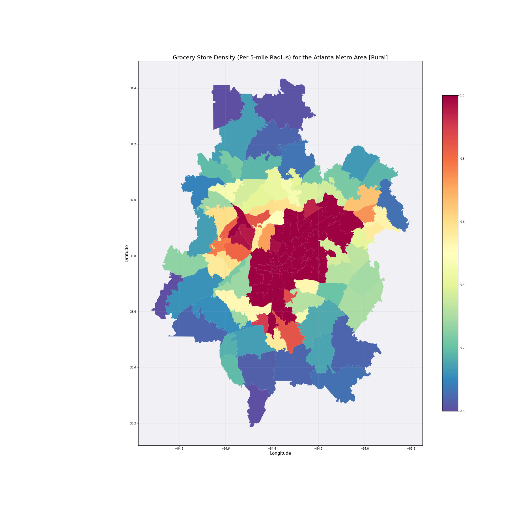
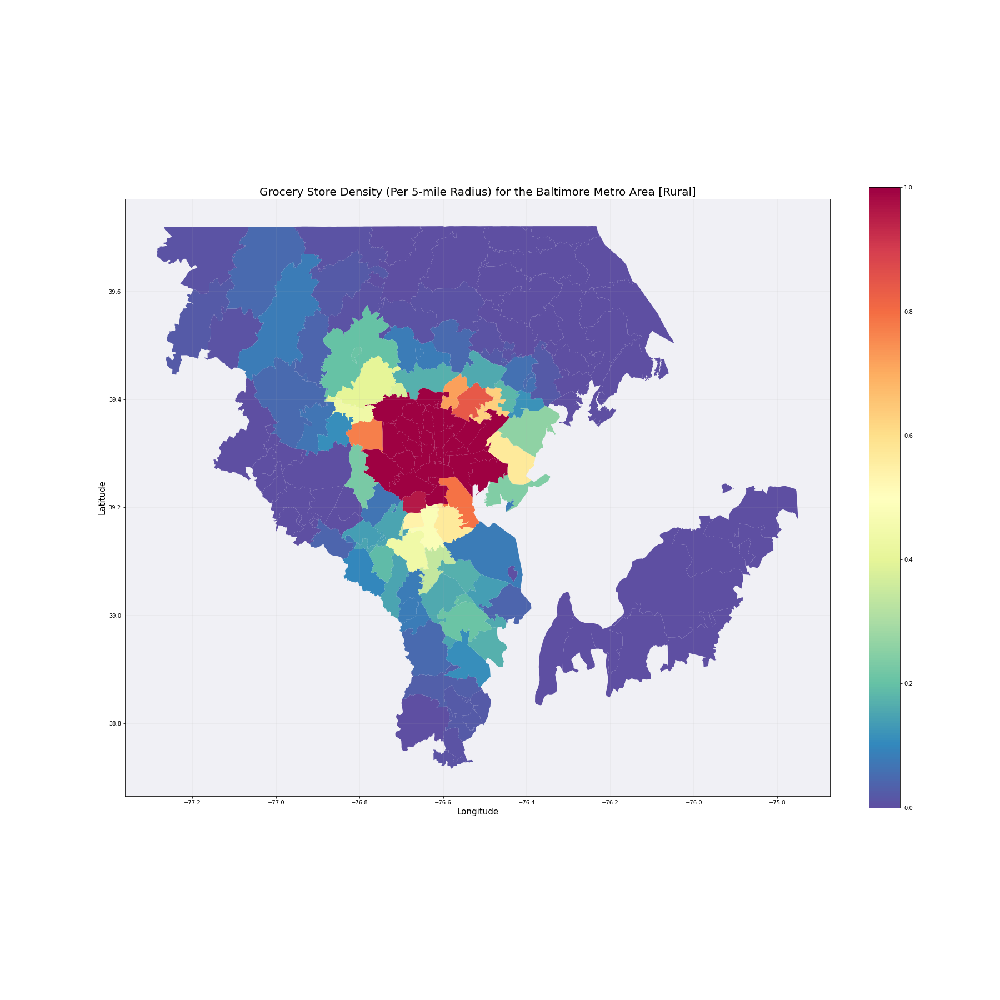

# DATA606Capstone
Race, Real Estate, and Food Equity in the U.S.

## Overview
-
-
-
## Contents
### Notebooks
- [SNAP]()
- [Redfin]()
- [Census]()
### Data
- [SNAP](SNAP_Data.csv)
- [Redfin]()
- [Census]()
- [Grocery Density Tables)[Groche Desnity)
- [zip Location per Metro](Metro_Zips)
- [zip Polygon data (for mapping)](Shape_Files)
## Goals
-
-
-
## Dataset Info
### SNAP
- This data contains a list of SNAP retailers with features including:
  - Location (address)
  - 
### Redfin
### Census
### FAR

## Graphs
Food Deserts are in part informed by the urban/rural spectrum. 
 
 

## Outcome
-
-
-
## Moving Forward
-
-
-
